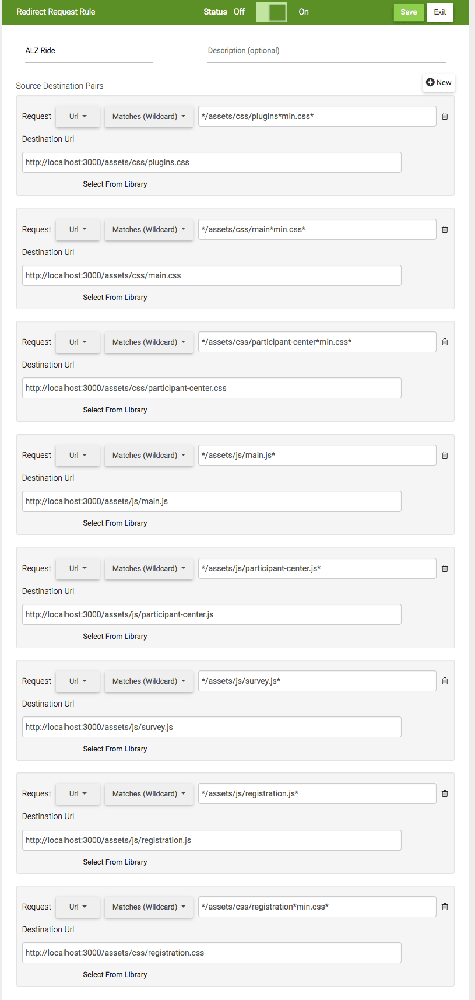

# Ride to End ALZ

## Project Setup
* Copy this directory to your repo.
* Navigate to this new directory in your terminal.
* Run `npm install` to install dependencies.
* After that process is finished, run `gulp build` to create an initial build of the files.
* Launch a local server of these files with live updating of HTML, CSS and JS with the command `gulp serve`.

## Browser Setup
* Install the [Requestly](https://chrome.google.com/webstore/detail/requestly-redirect-url-mo/mdnleldcmiljblolnjhpnblkcekpdkpa?hl=en) browser plugin.
* Click the Requestly icon in your browser toolbar
* In the new Requestly window that opens, click the "plus" icon
* Click "Redirect Request"
* Update the settings to match the parameters below and click "Save" and "On".
  

* Run the command `gulp serve`.
* With the local server now running, make your changes to files in the `app` directory of this project.
* Each time you save a change, Gulp will update the production files and Requestly will serve them to your PC (i.e. you'll be able to preview your updates by refreshing the PC after each save instead of having to manually upload the files).
* When you are ready to upload your changes, run the command `gulp build` and use the files outputted in the `dist` directory.


## Gulp Commands
`gulp serve` - starts localhost server with BrowserSync, watches HTML, Sass, JS with hot reloading for any HTML files served from the local server. If Requestly is configured correctly (see above), you can see your local updates applied to the ALZ Luminate instance by saving your changes and refreshing the Luminate page. *NOTE: If the local server is not running and Requestly is turned on, your browser will be served missing CSS and JS and the site will appear broken.*

`gulp build` - minifies CSS/JS and builds the production-ready ALZ assets in the dist directory.

## Overwriting Bootstrap Sass variables
You can overwrite specific bootstrap Sass variables by uncommenting lines in app/assets/css/1-frameworks/bootstrap/bootstrap-user-variables.scss

## Requirements
This project requires you have [nodejs](https://nodejs.org/en/) with [npm](https://www.npmjs.com/get-npm) installed.
This project requires you have a global installation of [gulp](http://gulpjs.com/).
```
# Install gulp globally
npm install -g gulp
```